# Dranaco

## Application developed for a construction company, designed to allow bulldozer operators to manage and order approved products for client projects directly through a mobile application.

## The application provides a complete workflow where bulldozer operators register, select clients, view approved products, and create delivery requests, ensuring seamless product management for construction projects.

## Development Technologies

- Flutter
- Dart

## Role
- Fullstack Developer / Frontend Developer

## Main Features and Workflow

1. **Login and Bulldozer Registration**  
   - Bulldozer operators log into their accounts and register their bulldozer using a unique identifier.

2. **Client Selection**  
   - Operators can search and select the client they are working with.

3. **Product Management**  
   - View the list of approved products associated with the selected client.
   - Products must be approved beforehand through quotations and agreements.

4. **Order Placement**  
   - Operators can select products and add them to a shopping cart.
   - Multiple products can be ordered for the same project or order.

5. **Delivery Options**  
   - Clients can choose between:
     - Delivery by truck.
     - Delivery by ship.
     - Personal pickup.

6. **Product Measurement**  
   - When ordering, operators can specify the weight or measurement of the selected products.

7. **Order Signing**  
   - After preparing the delivery, both the driver and the client can sign the delivery digitally.

## Screenshots

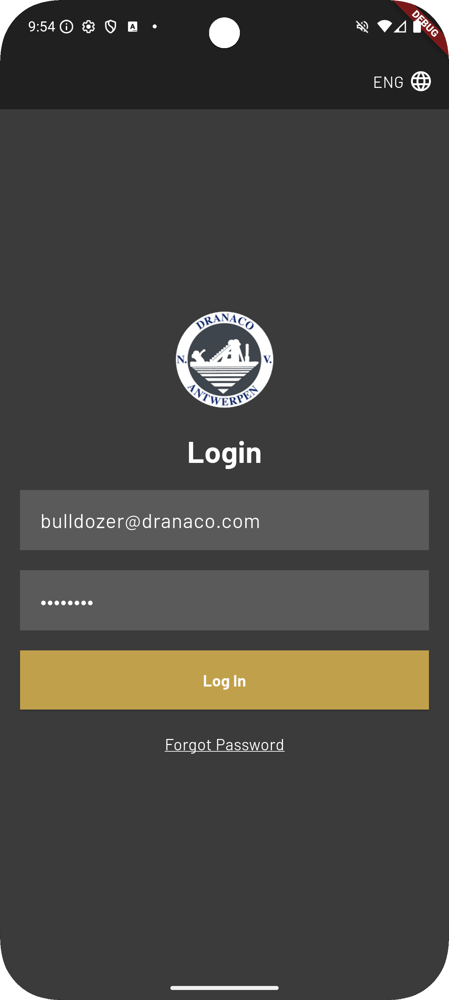
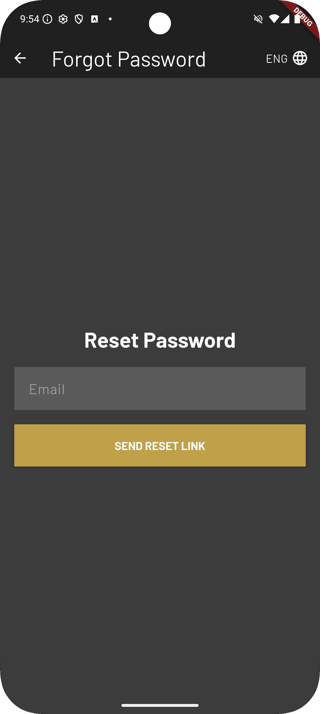
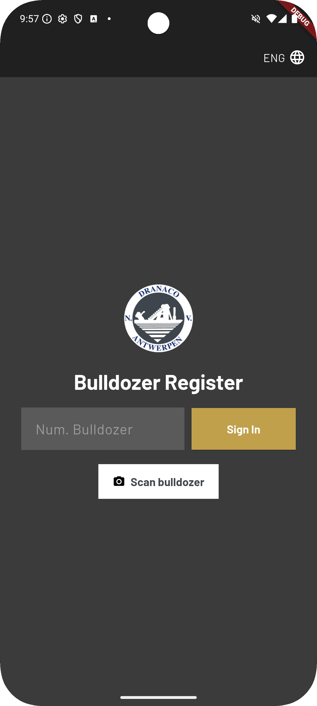

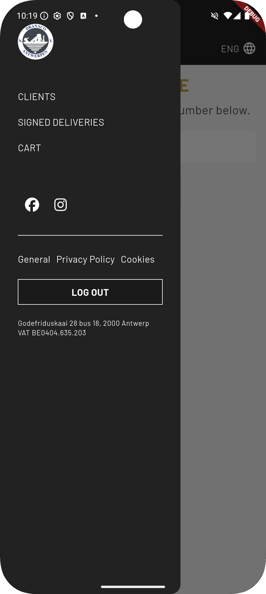
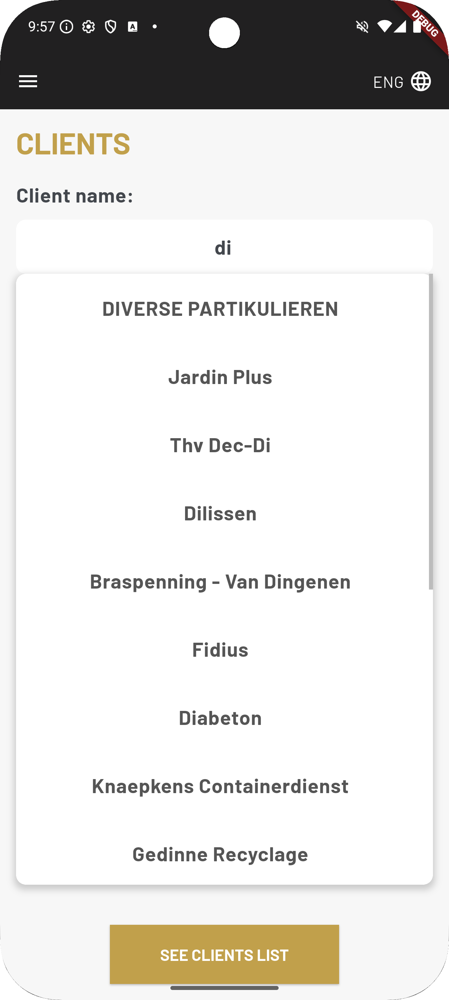
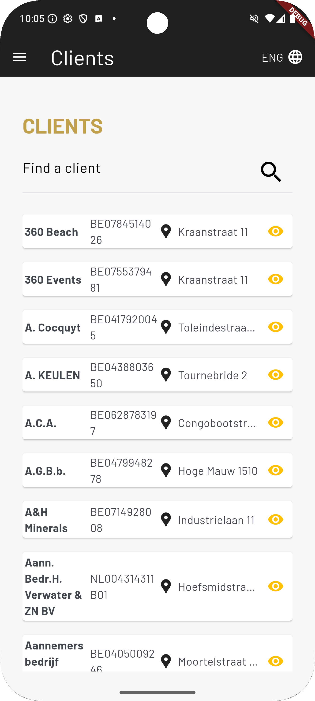
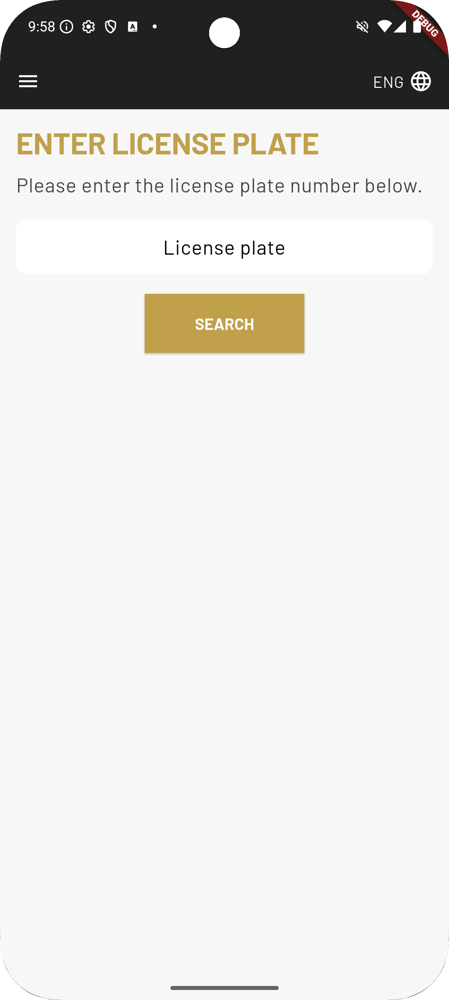
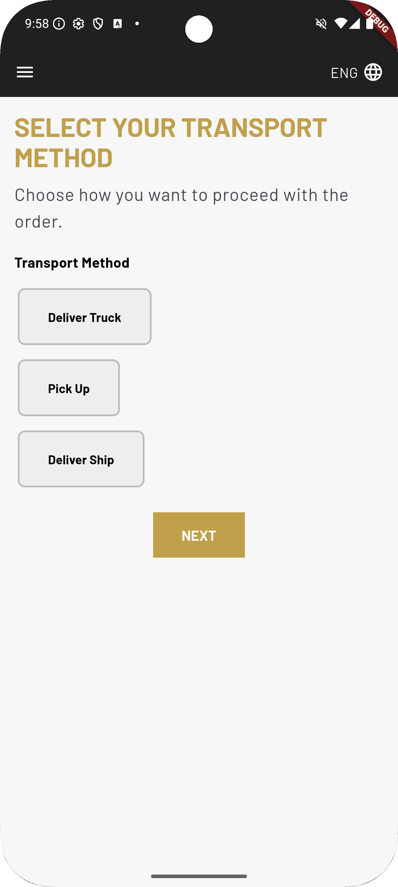
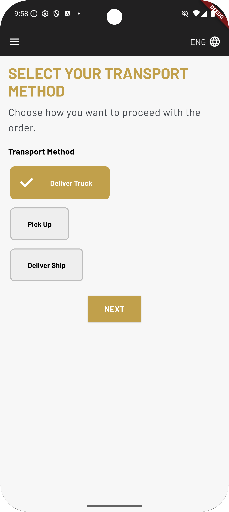
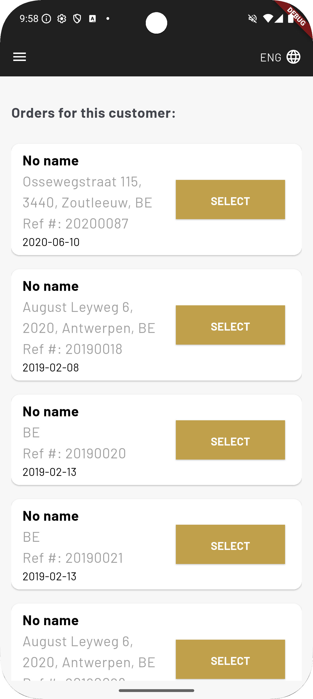
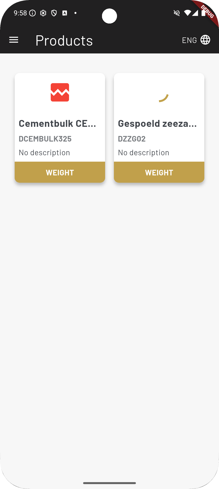
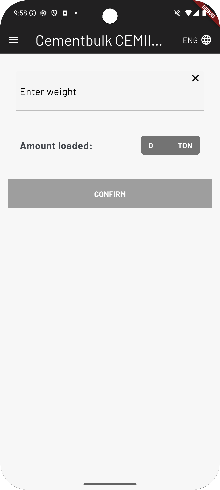
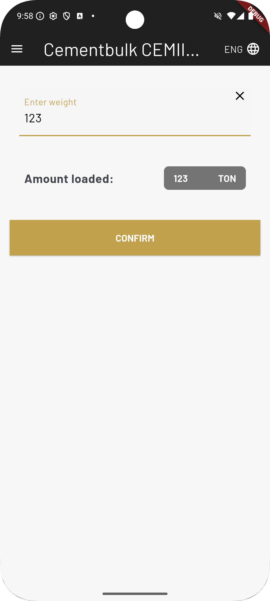
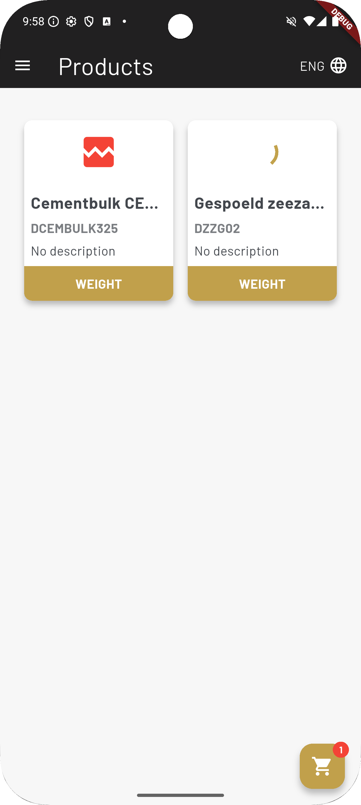
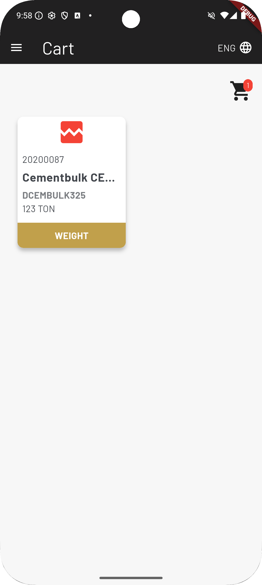
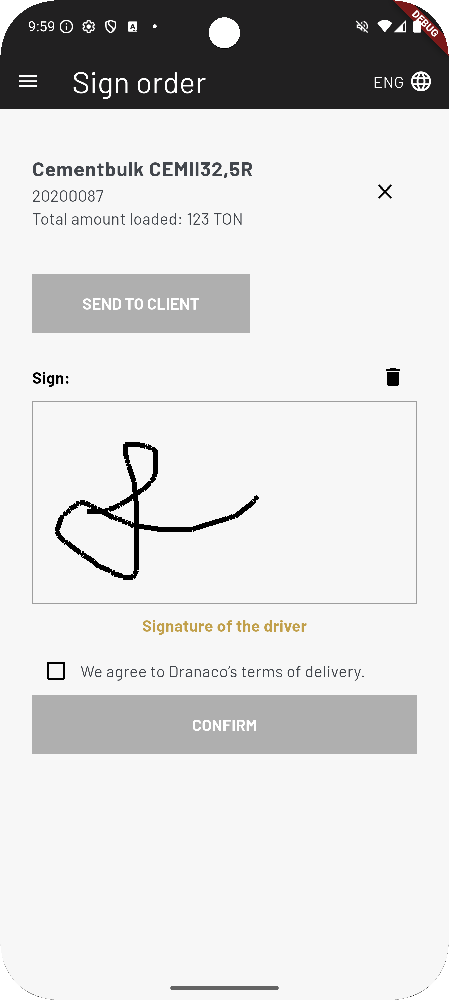
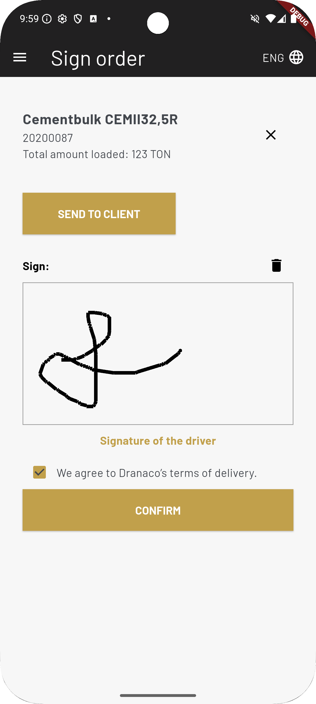

## **Note: It is not possible to upload the system code to a public repository due to internal company policies.**
